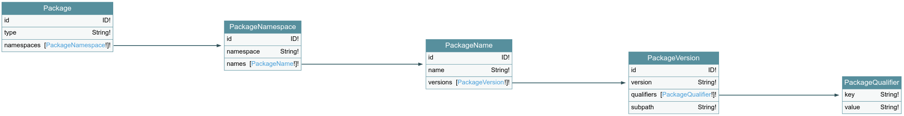
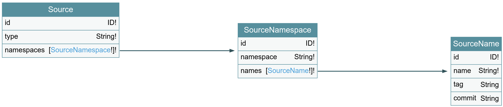

# GUAC GraphQL definitions

[GraphQL](https://graphql.org/) allows developers to define an API for a service
using a definition language and then serve this API via a single endpoint.
GraphQL also represents the runtime for fulfilling these queries. The design of
GraphQL is that queries can ask exactly for the data they need and only receive
that data. This empowers clients to be in control and more resilient in the face
of API changes. To get started, consult
[the official documentation](https://graphql.org/learn/).

This documents provides some insight into how the GraphQL API matches the
[GUAC ontology](https://github.com/guacsec/guac/blob/main/docs/ontology.md) and
its
[definition](https://github.com/guacsec/guac/blob/main/docs/ontology-definitions.md).

Note: the GraphQL definitions are not yet stable, they might change in future
code changes. To get an up to date view of the definitions, you can use one of
the following:

- Directly consult the source of truth represented by the
  [GraphQL SDL schema](https://github.com/guacsec/guac/tree/main/pkg/assembler/graphql/schema).
- Look at the generated Go documentation using `godoc` and analyzing the
  `guacsec/guac/pkg/assembler/graphql/model` package.
- Open the playground by passing `--gql-debug` to
  [`guacgql` component](https://github.com/guacsec/guac/blob/main/docs/Compose.md),
  then consult the documentation tab of the
  [Graphiql editor](https://github.com/graphql/graphiql).
- Use [GraphQL Voyager](https://ivangoncharov.github.io/graphql-voyager/). You
  can load the schema by using the introspection query on the `guacgql` server
  or by concatenating all the source of truth documents.

Note: If you change the GraphQL schema, you will need to regenerate the code
using `make generate` before you can use any of the above steps.

Note: GUAC uses GraphQL internally to ingest data and for the integrations
provided out-of-the box. Consult the
[GUAC client-side operations](https://github.com/guacsec/guac/tree/main/pkg/assembler/clients/operations)
for the document queries.

In the remainder of this document, we will go over the existing GraphQL types.

For each GraphQL type we also define 2 input types: one is used to filter the
results of a query (for example, to select only packages with a specific name),
and the other is used to specify what fields need to be provided to ingest the
corresponding GraphQL type (for example, for a package we only need to specify
its type and its name, all other fields are optional). In this document, we will
only focus on the data types, as the mapping from them to the input types is
trivial.

Each GraphQL type contains an `id` field, of type `ID`. This should be treated
as an opaque identifier and not shared across different instances of GUAC, as it
is backend specific.

## The GUAC Software Trees

The software trees can be thought as "nouns" in the GUAC ontology. These
represent subjects that we can talk about when we talk about the software supply
chain.

### Artifacts

An artifact is a file, or binary, an object that can be uniquely identified. For
each artifact, one can compute a checksum. In GUAC, we separate the algorithm
used for the checksum from the digest value as this will allow GUAC users to
find artifacts that are identified by deprecated checksum schemes. To remove
confusions, both of these fields are canonicalized to lowercase on ingestion and
querying.

```gql
type Artifact {
  id: ID!
  algorithm: String!
  digest: String!
}
```

In Go, if the artifact checksum is in a variable called `checksum`, we can
compute the two fields by:

```go
algorithm := strings.ToLower(string(checksum.Algorithm))
digest    := checksum.Value
```

### Packages

A package is a collection of one or more artifacts from a specific ecosystem
(e.g., all of the wheels on PyPI for a release of a specific project -- each
wheel might be used only on some operating system, each wheel is an artifact but
the package represents the collection of all). We represent a package by a
[pURL](https://github.com/package-url/purl-spec/blob/0dd92f26f8bb11956ffdf5e8acfcee71e8560407/README.rst),
but with some GUAC modifications and heuristics to bridge gaps with missing
naming standards.

In GUAC, we represent a package as a trie, split across several GraphQL types.
Each type matches a component of the pURL specification
(`pkg:<type>/<namespace>/<name>@<version>?<qualifiers>`):

```gql
type Package {
  id: ID!
  type: String!
  namespaces: [PackageNamespace!]!
}

type PackageNamespace {
  id: ID!
  namespace: String!
  names: [PackageName!]!
}

type PackageName {
  id: ID!
  name: String!
  versions: [PackageVersion!]!
}

type PackageVersion {
  id: ID!
  version: String!
  qualifiers: [PackageQualifier!]!
  subpath: String!
}

type PackageQualifier {
  key: String!
  value: String!
}
```



Optional strings on internal nodes (e.g., `PackageNamespace`) are stored as
empty. When ingesting, these would have an empty default value. Optional lists
are stored as empty lists and default to empty lists on ingestion.

Versions are optional. If a package version is specified, the ecosystem that
defines the package specifies how these should be handled.

Note: The handling of versions might change before this schema becomes stable!

Subpath and qualifiers are optional. Lack of qualifiers is represented by an
empty list and lack of subpath by empty string (to be consistent with
optionality of namespace and version). Two nodes that have different qualifiers
and/or subpath but the same version mean two different packages in the trie
(they are different). Two nodes that have same version but qualifiers of one are
a subset of the qualifier of the other also mean two different packages in the
trie.

Only some of the nodes in the package trie can be referred by other nodes in the
GUAC GraphQL definition.

### Sources

Each software package is built from a code repository. We represent these
repositories as source tries in GUAC. We map source information to a trie, as a
derivative of the pURL specification: each path in the trie represents a type
(that is, source control system being used), namespace (e.g., GitHub, GitLab,
etc.), name of repository and an optional qualifier that stands for tag/commit
information.

```gql
type Source {
  id: ID!
  type: String!
  namespaces: [SourceNamespace!]!
}

type SourceNamespace {
  id: ID!
  namespace: String!
  names: [SourceName!]!
}

type SourceName {
  id: ID!
  name: String!
  tag: String
  commit: String
}
```



The tag and commit fields are optional, but it is an error to specify both.

Just like in the package trie, only some of these types can be referred by other
nodes.

### Builders

An artifact for a package is produced by a builder (e.g., FRSA, GitHub Actions,
etc.). Currently, we only use an URI field to identify the builders:

```gql
type Builder {
  id: ID!
  uri: String!
}
```

### Vulnerabilities

For vulnerabilities, we define 3 different types: a CVE, a GitHub Security
Advisory (GHSA) and an [OSV](https://osv.dev/) identifier. Each vulnerability
can be recorded using at least one of these types.

```gql
type GHSA {
  id: ID!
  ghsaId: String!
}

type CVE {
  id: ID!
  year: Int!
  cveId: String!
}

type OSV {
  id: ID!
  osvId: String!
}
```

Note: The vulnerability types have 2 types of identifiers: one (of type `ID`) is
used internally by GUAC, the other is the vulnerability identifier. Each
vulnerability identifier is canonicalized to lower case upon ingestion and
querying. The vulnerability identifiers are defined by the underlying
vulnerability database.

The CVE vulnerability identifier contains a year field, so we are extracting
that to allow matching for vulnerabilities found in a given year.

## The GUAC Evidence Trees

The evidence trees represents facts about the software supply chain. In the GUAC
ontology, these can be thought as "verbs", linking together various "nouns"
(that is, linking two or more software trees together).

The evidence trees are created by GUAC after ingesting supply chain metadata
documents. As such, all evidence trees will record information about the
collector of such documents as well as the document itself (`source`). Post the
v0.1 BETA release of GUAC, evidence trees will also contain information about
actors. This enables GUAC users to control the trust levels that they use in
queries.

### Certifications for trust information

A user of GUAC can attach metadata to a package, source or artifact node to
state that they trust the specified piece of software (i.e., `CertifyGood`) or
that they have information that the specified piece of software should not be
used in the user's supply chain (i.e., `CertifyBad`). These are simple
certifications to determine the blast radius of a policy change or to attach
unconditional (lack of) trust information.

```gql
union PackageSourceOrArtifact = Package | Source | Artifact

type CertifyBad {
  id: ID!
  subject: PackageSourceOrArtifact!
  justification: String!
  origin: String!
  collector: String!
}

type CertifyGood {
  id: ID!
  subject: PackageSourceOrArtifact!
  justification: String!
  origin: String!
  collector: String!
}
```

The user cannot directly attach these metadata. They have to create specific
documents to ingest using GUAC certifiers. This ensures that the trust
information is collected (that is, the origin and collector), as well as a
justification for the metadata.

Note: Although the `subject` field points to the root of the `Source` and
`Package` tries, these certifications have additional requirements: attesting a
source must specify information to uniquely identify a `SourceName` whereas
attesting a package must specify information to uniquely identify a
`PackageName` or `PackageVersion`.

### Certifications for Scorecard analyses

GUAC can ingest [Scorecard](https://securityscorecards.dev/) information to
attach it to source tries. We extract the scorecard information to a separate
type.

```gql
type CertifyScorecard {
  id: ID!
  "The source repository that is being scanned (attestation subject)"
  source: Source!
  "The Scorecard attached to the repository (attestation object)"
  scorecard: Scorecard!
}

type Scorecard {
  "Individual Scorecard check scores (Branch-Protection, Code-Review, ...)"
  checks: [ScorecardCheck!]!
  "Overall Scorecard score for the source"
  aggregateScore: Float!
  "Exact timestamp when the source was last scanned (in RFC 3339 format)"
  timeScanned: Time!
  "Version of the Scorecard scanner used to analyze the source"
  scorecardVersion: String!
  "Commit of the Scorecards repository at the time of scanning the source"
  scorecardCommit: String!
  "Document from which this attestation is generated from"
  origin: String!
  "GUAC collector for the document"
  collector: String!
}

type ScorecardCheck {
  check: String!
  score: Int!
}
```

### Certifications for vulnerability statements.

We also have two certifications for vulnerabilities. First, a GUAC user can run
a vulnerability certifier on all packages in GUAC to record what vulnerabilities
are known at that time. To record that a package does not have vulnerabilities
at the scan time, we also define a special `NoVuln` type which is a singleton on
the backend.

```gql
type NoVuln {
  id: ID!
}

union Vulnerability = OSV | CVE | GHSA | NoVuln

type CertifyVuln {
  id: ID!
  "The package that is attested"
  package: Package!
  "The vulnerability object. Can be an OSV, CVE, or GHSA or the special NoVuln node."
  vulnerability: Vulnerability!
  "Metadata attached to the certification"
  metadata: VulnerabilityMetaData!
}

type VulnerabilityMetaData {
  "Time of scan (in RFC 3339 format)"
  timeScanned: Time!
  "URI of the vulnerability database used by the scanner"
  dbUri: String!
  "Version of the vulnerability database used by the scanner"
  dbVersion: String!
  "URI of the scanner"
  scannerUri: String!
  "Version of the scanner"
  scannerVersion: String!
  "Document from which this attestation is generated from"
  origin: String!
  "GUAC collector for the document"
  collector: String!
}
```

Next, a user can attach VEX statements to packages or artifacts to help with
handling of vulnerabilities.

```gql
union PackageOrArtifact = Package | Artifact

enum VexStatus {
  NOT_AFFECTED
  AFFECTED
  FIXED
  UNDER_INVESTIGATION
}

enum VexJustification {
  COMPONENT_NOT_PRESENT
  VULNERABLE_CODE_NOT_PRESENT
  VULNERABLE_CODE_NOT_IN_EXECUTE_PATH
  VULNERABLE_CODE_CANNOT_BE_CONTROLLED_BY_ADVERSARY
  INLINE_MITIGATIONS_ALREADY_EXIST
  NOT_PROVIDED
}

type CertifyVEXStatement {
  id: ID!
  "Subject of attestation"
  subject: PackageOrArtifact!
  "Attested vulnerability"
  vulnerability: Vulnerability!
  "Status of the vulnerabilities with respect to the subject"
  status: VexStatus!
  "Justification from VEX statement"
  vexJustification: VexJustification!
  "VEX statement: impact_statement or action_statement depending on status"
  statement: String!
  "statusNotes may convey information about how status was determined"
  statusNotes: String!
  "Timestamp (exact time in RFC 3339 format) for the VEX statement"
  knownSince: Time!
  "Document from which this attestation is generated from"
  origin: String!
  "GUAC collector for the document"
  collector: String!
}
```

Note: the `NoVuln` node is invalid in VEX statements as these apply to existing
vulnerabilities.

### Equality evidence

GUAC might ingest information about the same subject from two different metadata
even if these documents refer to the subject using different identifying
information. For example, one document might specify an artifact by a SHA256
digest whereas another might use SHA512. GUAC can certify that these are similar
by ingesting equality evidence documents.

```gql
type PkgEqual {
  id: ID!
  "Collection of packages that are similar"
  packages: [Package!]!
  "Justification for the claim that the packages are similar"
  justification: String!
  "Document from which this attestation is generated from"
  origin: String!
  "GUAC collector for the document"
  collector: String!
}

type HashEqual {
  id: ID!
  "Collection of artifacts that are similar"
  artifacts: [Artifact!]!
  "Justification for the claim that the artifacts are similar"
  justification: String!
  "Document from which this attestation is generated from"
  origin: String!
  "GUAC collector for the document"
  collector: String!
}
```

### "Is a" evidence trees

GUAC defines evidence trees that specify relationships of type "is a": these
specify that a certain software tree could be considered to be in a relationship
with another software tree.

First, GUAC defines evidence trees to link CVE or GHSA vulnerability types to
the information contained in the OSV database:

```gql
union CveOrGhsa = CVE | GHSA

type IsVulnerability {
  id: ID!
  "The OSV that encapsulates the vulnerability"
  osv: OSV!
  "The upstream vulnerability information"
  vulnerability: CveOrGhsa!
  "Justification for the attested relationship"
  justification: String!
  "Document from which this attestation is generated from"
  origin: String!
  "GUAC collector for the document"
  collector: String!
}
```

Next, GUAC records information that an artifact is produced from a source or a
package.

```gql
union PackageOrSource = Package | Source

type IsOccurrence {
  id: ID!
  "Package or source from which the artifact originates"
  subject: PackageOrSource!
  "The artifact in the relationship"
  artifact: Artifact!
  "Justification for the attested relationship"
  justification: String!
  "Document from which this attestation is generated from"
  origin: String!
  "GUAC collector for the document"
  collector: String!
}
```

Finally, GUAC records dependency information between two packages.

```gql
enum DependencyType {
  "direct dependency"
  DIRECT
  "indirect dependency"
  INDIRECT
  "type not known/not specified"
  UNKNOWN
}

"IsDependency is an attestation to record that a package depends on another."
type IsDependency {
  id: ID!
  "Package that has the dependency"
  package: Package!
  "Package for the dependency; MUST BE PackageName, not PackageVersion"
  dependentPackage: Package!
  "Version range for the dependency link"
  versionRange: String!
  "Type of dependency"
  dependencyType: DependencyType!
  "Justification for the attested relationship"
  justification: String!
  "Document from which this attestation is generated from"
  origin: String!
  "GUAC collector for the document"
  collector: String!
}
```

Note: The version range is currently an opaque string but this will likely
change in the future.

### "Has a" evidence trees

There are 3 more evidence trees that attest that a software tree has a certain
property of origin.

The first evidence tree of this type provides the ability to say that a package
is built from a certain repository:

```gql
type HasSourceAt {
  id: ID!
  "The subject of the attestation: can be a PackageName or a PackageVersion"
  package: Package!
  "Source repository from which the package is built"
  source: Source!
  "Timestamp since this link between package and source was certified"
  knownSince: Time!
  "Justification for the attested relationship"
  justification: String!
  "Document from which this attestation is generated from"
  origin: String!
  "GUAC collector for the document"
  collector: String!
}
```

We allow for the cases when the source of truth repository is transferred or
renamed. This also allows for packages in one ecosystem to be built from
different repositories than packages from another ecosystem (e.g., a similar
package but with Go sources in one repository and Python sources in another).

The next evidence tree in this section records that an artifact has been built
by a builder using a certain set of ingredient artifacts, the SLSA attestation:

```gql
type HasSLSA {
  id: ID!
  "The subject of SLSA attestation"
  subject: Artifact!
  "The SLSA attestation"
  slsa: SLSA!
}

type SLSA {
  "Materials of the build resulting in subject"
  builtFrom: [Artifact!]!
  "Builder performing the build"
  builtBy: Builder!
  "Type of the builder"
  buildType: String!
  "Individual predicates found in the attestation"
  slsaPredicate: [SLSAPredicate!]!
  "Version of the SLSA predicate"
  slsaVersion: String!
  "Timestamp (RFC3339Nano format) of build start time"
  startedOn: Time!
  "Timestamp (RFC3339Nano format) of build end time"
  finishedOn: Time!
  "Document from which this attestation is generated from"
  origin: String!
  "GUAC collector for the document"
  collector: String!
}
```

Finally, the last evidence tree defined in GUAC is attaching SBOM information to
packages and artifacts:

```gql
type HasSBOM {
  id: ID!
  "SBOM subject"
  subject: PackageOrArtifact!
  "Identifier for the SBOM document"
  uri: String!
  "Algorithm by which SBOMs digest was computed"
  algorithm: String!
  "Digest of SBOM"
  digest: String!
  "Location from which the SBOM can be downloaded"
  downloadLocation: String!
  "SBOM annotations (e.g., SBOM Scorecard information)"
  annotations: [Annotation!]!
  "Document from which this attestation is generated from"
  origin: String!
  "GUAC collector for the document"
  collector: String!
}

type Annotation {
  key: String!
  value: String!
}
```

## The GUAC Actor Trees

These are not defined for the v0.1 BETA version of GUAC. There is no GraphQL
definition for these as of now.

## Topological Definitions

Each GraphQL type defined so far has a semantic meaning, tied to the
[GUAC ontology](./ontology.md). However, in some cases, users might want to see
what GraphQL types are linked to a specific type, or they might want to find a
link between two different nodes. For these cases, we currently provide an
experimental interface to get topological information about the GUAC graph.

Note: These definitions are subject to change and might be removed in future
versions of GUAC. Treat this interface as experimental.

First, we define a union of all nodes in the GUAC ontology and an enum for all
the possible edges between them.

```gql
union Node =
    Package
  | Source
  | Artifact
  | Builder
  | OSV
  | CVE
  | GHSA
  | NoVuln
  | IsOccurrence
  | IsDependency
  | IsVulnerability
  | CertifyVEXStatement
  | HashEqual
  | CertifyBad
  | CertifyGood
  | PkgEqual
  | CertifyScorecard
  | CertifyVuln
  | HasSourceAt
  | HasSBOM
  | HasSLSA

enum Edge {
  ARTIFACT_CERTIFY_BAD
  ARTIFACT_CERTIFY_GOOD
  ARTIFACT_CERTIFY_VEX_STATEMENT
  ARTIFACT_HASH_EQUAL
  ARTIFACT_HAS_SBOM
  ARTIFACT_HAS_SLSA
  ARTIFACT_IS_OCCURRENCE
  BUILDER_HAS_SLSA
  CVE_CERTIFY_VEX_STATEMENT
  CVE_CERTIFY_VULN
  CVE_IS_VULNERABILITY
  GHSA_CERTIFY_VEX_STATEMENT
  GHSA_CERTIFY_VULN
  GHSA_IS_VULNERABILITY
  NO_VULN_CERTIFY_VULN
  OSV_CERTIFY_VEX_STATEMENT
  OSV_CERTIFY_VULN
  OSV_IS_VULNERABILITY
  PACKAGE_CERTIFY_BAD
  PACKAGE_CERTIFY_GOOD
  PACKAGE_CERTIFY_VEX_STATEMENT
  PACKAGE_CERTIFY_VULN
  PACKAGE_HAS_SBOM
  PACKAGE_HAS_SOURCE_AT
  PACKAGE_IS_DEPENDENCY
  PACKAGE_IS_OCCURRENCE
  PACKAGE_PKG_EQUAL
  SOURCE_CERTIFY_BAD
  SOURCE_CERTIFY_GOOD
  SOURCE_CERTIFY_SCORECARD
  SOURCE_HAS_SOURCE_AT
  SOURCE_IS_OCCURRENCE

  CERTIFY_BAD_ARTIFACT
  CERTIFY_BAD_PACKAGE
  CERTIFY_BAD_SOURCE
  CERTIFY_GOOD_ARTIFACT
  CERTIFY_GOOD_PACKAGE
  CERTIFY_GOOD_SOURCE
  CERTIFY_SCORECARD_SOURCE
  CERTIFY_VEX_STATEMENT_ARTIFACT
  CERTIFY_VEX_STATEMENT_CVE
  CERTIFY_VEX_STATEMENT_GHSA
  CERTIFY_VEX_STATEMENT_OSV
  CERTIFY_VEX_STATEMENT_PACKAGE
  CERTIFY_VULN_CVE
  CERTIFY_VULN_GHSA
  CERTIFY_VULN_NO_VULN
  CERTIFY_VULN_OSV
  CERTIFY_VULN_PACKAGE
  HASH_EQUAL_ARTIFACT
  HAS_SBOM_ARTIFACT
  HAS_SBOM_PACKAGE
  HAS_SLSA_BUILT_BY
  HAS_SLSA_MATERIALS
  HAS_SLSA_SUBJECT
  HAS_SOURCE_AT_PACKAGE
  HAS_SOURCE_AT_SOURCE
  IS_DEPENDENCY_PACKAGE
  IS_OCCURRENCE_ARTIFACT
  IS_OCCURRENCE_PACKAGE
  IS_OCCURRENCE_SOURCE
  IS_VULNERABILITY_CVE
  IS_VULNERABILITY_GHSA
  IS_VULNERABILITY_OSV
  PKG_EQUAL_PACKAGE
}
```

Each member of the edges enumeration is formed by merging two `Node` names with
`_`. Each name is converted from `CamelCase` to `CAPITALS_WITH_UNDERSCORES`.
Only valid edges (pairs from Node to Node) are included.

The only exception to this above rule is for links out of `HasSLSA`. The names
are `HAS_SLSA_SUBJECT`, `HAS_SLSA_BUILT_BY`, and `HAS_SLSA_MATERIALS`. This is
because `ARTIFACT_HAS_SLSA` is only defined from subject `Artifact` to
`HasSLSA`.

With these, we can define 4 queries that return `Node`s without looking at their
type, but only at their connectivity:

```gql
node(node: ID!): Node!
nodes(nodes: [ID!]!): [Node!]!
neighbors(node: ID!, usingOnly: [Edge!]!): [Node!]!
path(subject: ID!, target: ID!, maxPathLength: Int!, usingOnly: [Edge!]!): [Node!]!
}
```

In a path query, all connecting evidence nodes along with their intermediate
subject nodes need to be returned in order to create a complete graph. The
`usingOnly` argument allow filtering what edges to include in `neighbors` and
`path`: if it is empty then all edge types are included, otherwise only the
edges that are specified.
